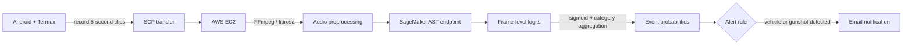

# Neighbor Heard: Audio Event Detection and Notification System

An end-to-end prototype that records environmental audio on an Android device, processes it on AWS, classifies sound events with an Audio Spectrogram Transformer (AST), and sends an email alert when selected events are detected.

> **Project status:** Historical course prototype. The original AWS endpoint and infrastructure may no longer be active. This repository documents the system design and implementation; it is not a production safety system.

## My Contribution

This was a three-person group project. My work focused on:

- audio data preprocessing and format standardization;
- model training and experimentation for audio-event classification;
- integrating the model output into the inference pipeline; and
- testing the classification workflow on collected audio samples.

The public repository contains the inference and deployment snapshot, but not the original training notebook, dataset, or experiment logs. I therefore do not report a benchmark metric here that cannot be independently verified from the repository.

## System Architecture

## Machine-Learning Pipeline

1. **Capture:** Termux records short microphone clips on an Android device.
2. **Transfer:** Each clip is securely copied to an EC2 instance.
3. **Standardize:** FFmpeg converts incoming audio to a mono WAV file; `librosa` streams the file into overlapping frames.
4. **Classify:** Frames are sent to a SageMaker endpoint serving an Audio Spectrogram Transformer based on the MIT AudioSet checkpoint.
5. **Aggregate:** Model logits are converted with a sigmoid function and averaged by event category across frames.
6. **Notify:** Rule-based logic checks selected categories such as vehicle and gunshot events and triggers an SMTP email alert.

## Repository Map

| File | Purpose |
|---|---|
| `audio_collection.py` | Records five-second clips in Termux and transfers them to EC2 |
| `preprocess_audio.py` | Converts incoming audio to a consistent mono WAV format |
| `model.py` | Loads the AudioSet-pretrained AST model and returns top event predictions |
| `email_noti.py` | Streams audio, calls the SageMaker endpoint, aggregates predictions, and sends alerts |
| `run_email_noti.sh` | Repeats preprocessing and inference on the EC2 instance |
| `streamlit_visualization.py` | Visualizes collected sensor and location information |
| `.env.example` | Documents required environment variables without committing credentials |

## Technologies

- Python, NumPy, PyTorch, Hugging Face Transformers
- `librosa`, FFmpeg, SoX
- AWS EC2, SageMaker, Boto3
- Android Termux, SCP, shell automation
- SMTP email notifications

## Reproducibility Notes

The repository is a deployment snapshot from a course project rather than a packaged library. Reproducing the original system requires:

- an Android device with Termux and microphone permission;
- an EC2 instance with FFmpeg and the Python dependencies installed;
- a SageMaker endpoint compatible with the expected prediction format; and
- local environment variables for AWS and email credentials.

Copy `.env.example` to `.env` and provide your own credentials. Never commit `.env`, private keys, email passwords, or active infrastructure addresses.

## Known Limitations

- The public snapshot does not include the training dataset, training notebook, saved model artifacts, or benchmark results.
- Alert thresholds were selected for the prototype and were not calibrated for production use.
- Averaging frame-level probabilities can miss short-duration events.
- The current scripts assume a specific cloud deployment and need configuration before reuse.
- This system should not be used as a substitute for emergency or security services.

## Team

Group project by MeilinP, rdzhao, and ckalsdh for USC DSCI 560.

## License

MIT License. See [`LICENSE`](LICENSE).
