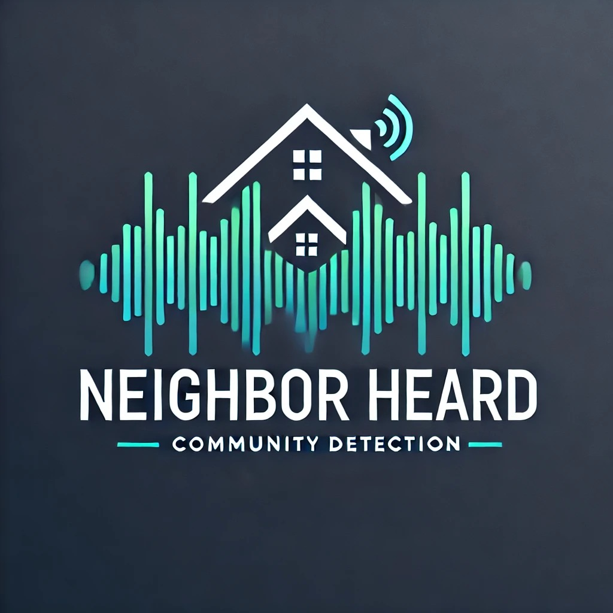

# Neighbor Heard: Audio Event Detection and Notification System



This project automates the process of recording audio on an Android device using Termux, sending the audio to an AWS EC2 instance for processing, classifying the audio events using a SageMaker endpoint, and sending email alerts if certain conditions (e.g., presence of a vehicle, gunshot, or engine sound) are met. This is a group project by MeilinP, rdzhao, and ckalsdh.

## Overview

1. **Capture Audio on Termux (Android)**:  
   Use `termux-microphone-record` or `sox` to record short audio clips at regular intervals.

2. **Transfer Audio to AWS EC2**:  
   Automatically upload recorded audio files from Termux to an EC2 instance using `scp`.  
   - A cron job on Termux triggers recording and uploading.
   - EC2 receives the file, which is processed and analyzed.

3. **Audio Processing and Classification on EC2**:  
   - The EC2 instance uses `librosa` to stream and process the audio data.
   - AWS SageMaker Predictor calls a pre-deployed endpoint (e.g., an Audio Spectrogram Transformer model) to classify audio events (e.g., "Vehicle", "Gunshot, gunfire", "Engine").
   - The raw logits are converted to probabilities using a sigmoid function and aggregated across audio frames.

4. **Email Notifications**:  
   If the classification meets certain conditions (for example, "Vehicle" or "Gunshot, gunfire" probabilities ≥ 0.03), an email alert is sent.

5. **Automation and Scheduling**:  
   - Cron jobs run on Termux to continuously capture and send audio files.
   - Cron or systemd timers on EC2 can periodically process incoming files and run the classification script.

## Key Components

- **Termux (Android)**:
  - **termux-microphone-record**: Records audio from your phone’s microphone.
  - **scp**: Securely copies the recorded audio file to the EC2 instance.
  - **cron**: Automates recording and uploading at regular intervals.

- **SageMaker(AWS)**:
  - **Python environment** with `numpy`, `librosa`, `boto3`, `sagemaker`, `dotenv`, `ffmpeg`, `sox`.
  - **SageMaker Endpoint**: A pre-trained audio classification model endpoint.
  - **Scripts**:
    - `predict_send_mail` function (within `email_noti.py`):  
      - Loads `.env` credentials for AWS and email.
      - Uses SageMaker’s Predictor to classify audio events.
      - Evaluates conditions for sending an email alert.
    - Converts MP4-based audio (if recorded that way) to WAV format for processing.
    - Extracts event categories and probabilities.
  
  - **SMTP (Gmail)**:
    - Uses `smtplib` to send email alerts based on classification results.
    - Credentials stored in `.env` file.

- **EC2 Instance (AWS)**:
  - **Python environment** with `numpy`, `librosa`, `boto3`, `sagemaker`, `dotenv`, `ffmpeg`, `sox`.
  - **SageMaker Endpoint**: A pre-trained audio classification model endpoint.
  - **Scripts**:
    - `predict_send_mail` function (within `email_noti.py`):  
      - Loads `.env` credentials for AWS and email.
      - Uses SageMaker’s Predictor to classify audio events.
      - Evaluates conditions for sending an email alert.
    - Converts MP4-based audio (if recorded that way) to WAV format for processing.
    - Extracts event categories and probabilities.
  
  - **SMTP (Gmail)**:
    - Uses `smtplib` to send email alerts based on classification results.
    - Credentials stored in `.env` file.

- **AWS Credentials and ENV Setup**:
  - Store `AWS_ACCESS_KEY_ID`, `AWS_SECRET_ACCESS_KEY`, and `EMAIL_ADDRESS`, `EMAIL_PASSWORD` in a `.env` file.
  - `dotenv` loads these environment variables at runtime.

## Prerequisites

1. **Termux (on Android)**:
   - Install packages: `pkg install sox openssh cronie aws-cli ffmpeg termux-api`.
   - Grant microphone permissions in Termux app settings.
   
2. **AWS EC2 Instance**:
   - A running EC2 instance (Ubuntu or Amazon Linux).
   - `sudo apt update && sudo apt install -y python3 python3-pip sox ffmpeg`
   - `pip install librosa sagemaker boto3 numpy python-dotenv`

3. **SageMaker Endpoint**:
   - A deployed endpoint serving an audio classification model (e.g., AST model).
   - Ensure `endpoint_name` is correctly set in the script.

4. **Email Credentials**:
   - A Gmail account with App Passwords enabled (if using Gmail).
   - Store credentials in `.env`:
     ```
     EMAIL_ADDRESS=your_email@gmail.com
     EMAIL_PASSWORD=your_app_password
     AWS_ACCESS_KEY_ID=your_aws_access_key
     AWS_SECRET_ACCESS_KEY=your_aws_secret_key
     ```
   
   - Ensure `SMTP_SERVER` and `SMTP_PORT` are correct (for Gmail: `smtp.gmail.com`, port `587`).

## Setup Instructions

1. **On Termux**:
   - Collect audio and send it to EC2 instance every 10 seconds
    ```bash
      python audio_collection.py
    ```

2. **On EC2**:
   - Ensure `email_noti.py`, `preprocess_audio` and `.env` are in place.
   - Run the script manually to test:
     ```bash
      python3 email_noti.py
     ```
   - Now run `run_email_noti.sh`. Will check for output every 10 seconds.
     ```bash
      #!/bin/bash
      while true; do
          python3 preprocess_audio.py
          python3 email_noti.py
          sleep 10
      done
     ```

3. **On SageMaker**:
    - Make sure AWS_ACCESS_KEY_ID, AWS_SECRET_ACCESS_KEY, region and endpoint are set correctly.

## Troubleshooting

- **No Audio Detected**:
  - Check Termux microphone permissions and verify that `termux-microphone-record` produces a playable audio file.
  - Use `file output.mp3` or `play output.mp3` (if sox is installed) to confirm it’s a valid audio file.

- **Incorrect File Format**:
  - If `output.wav` is actually MP4, convert using `ffmpeg`:
    ```bash
    ffmpeg -y -i output.wav -ar 44100 -ac 1 processed_output.wav
    ```
  - Update the processing script to handle conversion before inference.

- **SageMaker Endpoint Errors**:
  - Check AWS credentials and region.
  - Confirm the endpoint name matches the deployed model.
  - Test the predictor with known audio locally.

- **Email Not Sending**:
  - Verify SMTP credentials and `.env` variables.
  - Check AWS EC2 security group and firewall rules (if required).
  - Make sure `EMAIL_ADDRESS` and `EMAIL_PASSWORD` are correct.

## Contributing

- Fork this repository and create feature branches for improvements.
- Submit pull requests and provide clear commit messages.

## License

This project is for demonstration purposes and does not include a specific license. Use at your own discretion.

---
